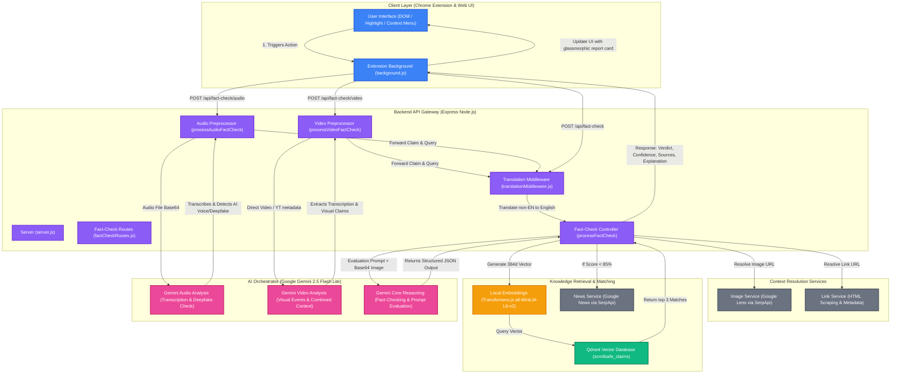

# ScrollSafe: Multi-Modal AI Fact-Checking Ecosystem

ScrollSafe is a state-of-the-art fact-checking platform that combines historical records, live news, and multi-modal AI to combat misinformation across text, images, audio, and video.

## 🚀 Features

- **Text Analysis**: Highlight any text on the web to instantly verify its authenticity.
- **Image Context**: "See" what an image is about using Google Lens and Gemini Vision.
- **Audio Deepfake Detection**: Analyze uploaded audio to detect AI-generated synthetic speech.
- **Video Fact-Checking**: Dedicated analysis for YouTube Shorts, standard videos, and X (Twitter) media.
- **Premium Glassmorphism UI**: A beautiful, non-intrusive extension interface with smooth animations.
- **Detailed Reports**: In-depth logic breakdowns with confidence scores and source attributions.

## 🛠️ Technology Stack

- **Extension**: Vanilla JavaScript, Manifest V3, CSS Glassmorphism.
- **Frontend**: React (Vite), Framer Motion, Tailwind CSS.
- **Backend**: Node.js, Express, Qdrant (Vector DB).
- **AI Models**: Google Gemini (Gen-3 Flash), Transformers.js (Local Embeddings).
- **External APIs**: SerpApi (Google Lens/News).

## 🗺️ System Architecture & Data Flow

Below is the end-to-end data flow and architectural design of the ScrollSafe ecosystem, illustrating how different media types (text selection, images, links, audio files, and videos) are processed, analyzed, and verified.



## ⚙️ How It Works

ScrollSafe processes fact-checking requests through a multi-tiered pipeline:

### 1. Context Trigger & Extraction
* **Text Verification**: Highlighting text (>20 characters) on any web page prompts a floating action button. Clicking it initiates a textual fact-check.
* **Image Intelligence**: Right-clicking any image triggers a Google Lens search via SerpApi to gather visual matches, titles, source domains, and related descriptions. The image file is also downloaded and sent directly to Gemini for visual analysis.
* **Link Extraction**: Targets URLs are crawled by the backend to extract page titles, meta descriptions, and primary header elements to reconstruct page context.
* **Audio Verification**: Uploaded audio files are parsed at `/api/fact-check/audio`. The audio buffer is processed by Gemini to generate a high-fidelity transcript, identify the primary language, and detect synthetic speech anomalies (AI deepfake voice detection).
* **Video Verification**: Videos (direct uploads, raw URLs, or YouTube Shorts/X media context) are processed at `/api/fact-check/video`. Video feeds are analyzed by Gemini to extract key actions, on-screen text, audio transcriptions, and contextual metadata.

### 2. Local Embedding & Memory Retrieval
* Every extracted textual claim is routed through a local feature-extraction pipeline using `@xenova/transformers`.
* The claim is converted into a 384-dimensional dense vector using the `Xenova/all-MiniLM-L6-v2` model natively on the server.
* The vector is queried against a **Qdrant Vector Database** (`scrollsafe_claims` collection) to search for historical fact-checks.
* If a match is found with a similarity score **&ge; 85%**, it is treated as a highly identical historic claim, and the system bypasses live search to reduce latency and API usage.

### 3. Real-Time News Verification Fallback
* If the highest historical match from Qdrant falls below the **85%** similarity threshold, ScrollSafe initiates a live Google News search query via **SerpApi**.
* This queries recent and breaking news databases to fetch top relevant articles, headlines, publication sources, dates, and text snippets.

### 4. Multi-Modal AI Evaluation & Reasoning
* A comprehensive evaluation prompt is generated containing the user's claim, top historical matches from Qdrant, and live news summaries.
* This prompt is processed by the **Google Gemini 2.5 Flash Lite** model. If an image is associated, it is passed as inline Base64 data for multi-modal verification.
* The model performs logical verification, prioritizing recent real-world events over historical data in case of direct contradictions, and produces a structured JSON output:
  * **Verdict**: `TRUE`, `FALSE`, or `UNCERTAIN`
  * **Confidence**: Confidence score (`0-100`)
  * **Explanation**: Nuanced, source-aware fact-checking breakdown.

### 5. User Feedback (Extension Interface)
* The structured response is returned to the extension, updating the UI with a beautiful glassmorphic card customized to the verdict's tone (Green for True, Red for False, Yellow for Uncertain).
* Clicking "Read Full Report" opens a dedicated report page (`detail.html`) displaying confidence dials, sources list, visual matches, and full breakdown documents.

## 📦 Project Structure

- `extension/`: The Chrome extension source code.
- `frontend/`: The React-based web application.
- `backend/`: The Node.js server and AI orchestration logic.

## 🏁 Getting Started

### 1. Backend Setup
```bash
cd backend
npm install
cp .env.example .env # Add your API keys (GEMINI, SERPAPI, QDRANT)
npm start
```

### 2. Frontend Setup
```bash
cd frontend
npm install
npm run dev
```

### 3. Extension Setup
1. Open Chrome and navigate to `chrome://extensions/`.
2. Enable "Developer mode".
3. Click "Load unpacked" and select the `extension/` folder in this repository.

## 📄 License
ScrollSafe is proprietary. All rights reserved.
