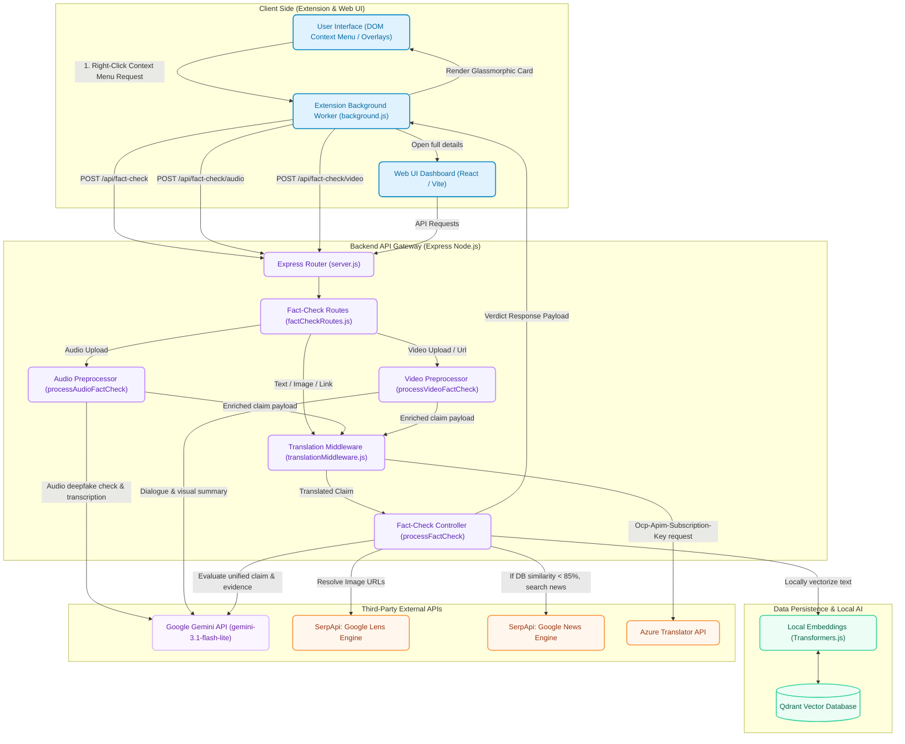
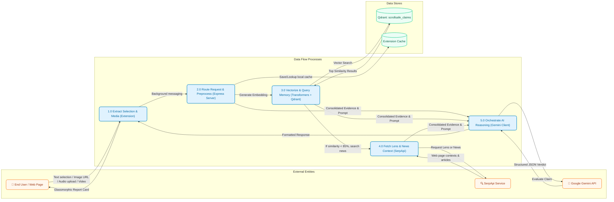
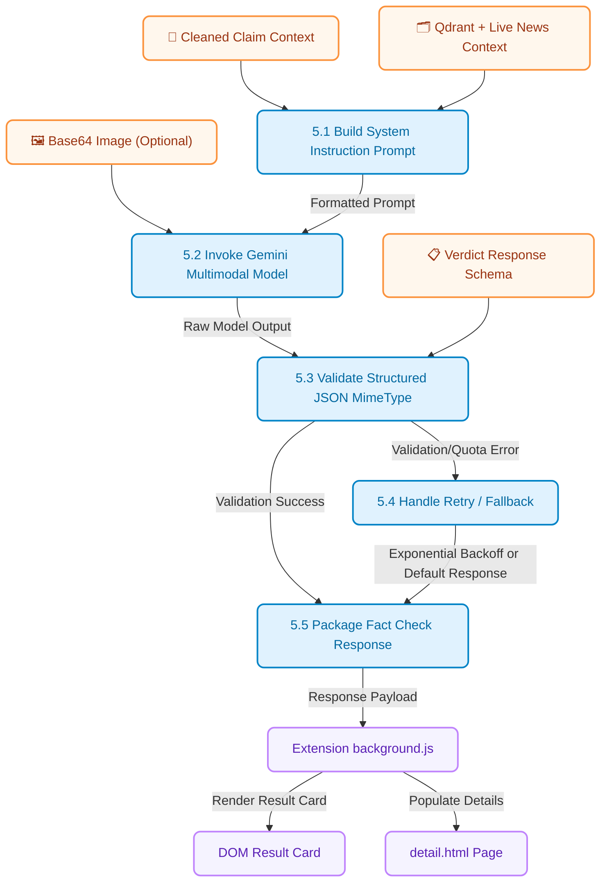

<p align="center">
  
</p>

# ScrollSafe

> [!NOTE]
> For a detailed architectural breakdown of fact-checking pipeline execution, AI models, vector search, and routing decisions, check out the [SRS System Requirements Specification](./SRS.md).

> [!WARNING]
> **API Configuration Notice**: ScrollSafe requires valid credentials for Google Gemini (using model `gemini-3.1-flash-lite`), Qdrant Cloud Database, and SerpApi (Google Lens/News engine integration) to perform multi-modal verification. Please verify that your local `.env` files are configured appropriately (see Configuration).

**ScrollSafe** is a state-of-the-art fact-checking ecosystem that combines historical database records, real-time news retrieval, and multi-modal AI models to combat misinformation across text, images, audio, and video formats. It functions as a lightweight browser extension that provides premium on-page context overlays and in-depth report generation.

---

## 🚀 Key Features

*   **Multi-Modal AI Fact-Checking Ecosystem**: Integrates live news databases, historical records, and Google Generative AI to analyze text highlights, image metadata, audio recordings, and video feeds.
*   **Context Menu Trigger Integration**: Right-click text selections, images, or links to trigger analysis seamlessly via the native browser context menu, eliminating disruptive overlay buttons.
*   **Automated Audio Deepfake Preprocessor**: Transcribes audio uploads and runs vocal frequency checks to detect AI-generated voice synthesis and deepfake anomalies prior to fact-checking.
*   **Dynamic Video & YouTube Shorts Scanners**: Periodically scans the page DOM for YouTube Shorts, X (Twitter) media, and video frames, injecting customized floating analysis triggers.
*   **Dense Vector Embedding Pipeline**: Claims are vectorized locally on the server using a 384-dimensional native transformer model (`Xenova/all-MiniLM-L6-v2`) via `@xenova/transformers`.
*   **Hybrid Search Memory**: Queries vector databases (Qdrant) first; if a match of &ge; 85% is resolved, the system returns results instantly, saving API cost. Otherwise, it falls back to SerpApi (Google News engine) query parsing.
*   **Structured JSON Schema Output**: Constraints are strictly enforced on Gemini responses via JSON schemas, returning a solid verdict (`TRUE`, `FALSE`, or `UNCERTAIN`), a confidence score, and clear source references.
*   **Premium Glassmorphism UI**: Beautiful tailwind dashboards and overlay reports styled with premium translucent panels, custom layouts, and interactive confidence dials.

---

## 🛠️ Tech Stack

*   **Browser Extension**: Vanilla Javascript, CSS Glassmorphism, Manifest V3, Chrome APIs (Context Menus, Runtime Message, Storage)
*   **Backend Service**: Node.js, Express, Multer, dotenv, CORS
*   **Frontend App**: React (Vite), Tailwind CSS, Framer Motion, Lucide Icons, canvas-confetti
*   **AI Orchestration**: Google Gen AI SDK (`@google/genai` + `gemini-3.1-flash-lite`), Xenova Transformers (`all-MiniLM-L6-v2`)
*   **Database & Storage**: Qdrant Vector Cloud Database, Local Memory Caching
*   **Web Verification**: SerpApi (Google Lens & Google News Engine), Azure Translator API (Microsoft Cognitive Services)

---

## 📂 Project Architecture & Data Flows

### 1. System Architecture Diagram
This diagram illustrates the physical and logical layout of the ScrollSafe platform, mapping client interactions, middleware limits, routes, context resolution, knowledge retrieval, and third-party APIs:



### 2. Data Flow Diagram (DFD Level 1)
This Data Flow Diagram tracks the movement of information across the boundaries between external entities, background processes, database layers, and final destinations:



### 3. Data Flow Diagram (DFD Level 2 - AI Processing Pipeline)
This Level 2 DFD decomposes **Process 5.0 (Orchestrate AI Reasoning)** to illustrate the detailed data routing, prompt construction, security checks, and response packaging:



---

## ⚙️ Environment Configuration

Create a `.env` file in the `backend` directory and configure the following variables:

```env
# Google Gemini API Credentials
GEMINI_API_KEY="AIzaSyA-..."

# SerpApi API Credentials (For Google Lens & Google News)
SERPAPI_API_KEY="c16b87..."

# Azure Cognitive Services Translator Credentials (Optional fallback)
AZURE_TRANSLATOR_KEY="EbXsTx..."
AZURE_TRANSLATOR_REGION="centralindia"

# Qdrant Database Credentials (Defaults are supplied in code but configurable)
QDRANT_URL="https://..."
QDRANT_API_KEY="eyJ..."
```

---

## 🏃 Getting Started

### 1. Run the Backend Server
Navigate to the backend directory, install the required packages, and launch the Express endpoint:
```bash
cd backend
npm install
npm start
```
The server will boot up and load the local Embedding model asynchronously on `http://localhost:3000`.

### 2. Run the Frontend App
Navigate to the frontend directory, install the required packages, and run the development bundle:
```bash
cd frontend
npm install
npm run dev
```
Open your browser at `http://localhost:5173` (or the port specified in console) to view the detail report dashboard.

### 3. Load the Browser Extension
1. Open Google Chrome (or any Chromium browser) and navigate to `chrome://extensions/`.
2. Enable the **Developer Mode** toggle in the top-right corner.
3. Click the **Load unpacked** button in the top-left.
4. Select the `extension/` subdirectory within this repository.
5. Highlight any text on screen, right-click, and select **Check with ScrollSafe**!

---

## 📄 License
ScrollSafe is proprietary. All rights reserved.
